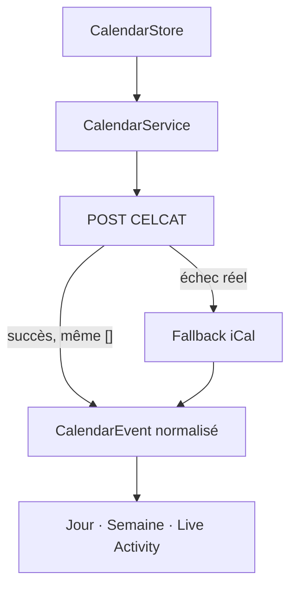

# Coursly

[](https://github.com/Bastian-Noel/Coursly/actions/workflows/build.yml)
[](https://github.com/Bastian-Noel/Coursly/releases)


[](LICENSE)

L’emploi du temps CELCAT de l’IUT de Vélizy, dans une application iPhone native conçue pour être consultée en quelques secondes.

Coursly affiche la journée ou la semaine sur une timeline réelle de 24 heures, suit le cours en cours sur l’écran verrouillé et permet de parcourir l’emploi du temps dans le passé comme dans le futur. L’application est développée en Swift 6 et SwiftUI pour iOS 26.

[Installer Coursly](https://bastian-noel.github.io/Coursly/) · [Télécharger la dernière IPA](https://github.com/Bastian-Noel/Coursly/releases) · [Consulter la documentation](docs/README.md)

> [!IMPORTANT]
> Les IPA publiées sont volontairement non signées. Elles doivent être signées sur l’iPhone avec Feather, SideStore ou un outil équivalent.

## Ce que fait Coursly

- Vue **Jour** avec timeline `00:00 → 24:00`, cours positionnés à leur heure réelle et ligne rouge pour l’heure courante.
- Vue **Semaine** sous forme de ruban continu : cinq jours visibles, heures fixes à gauche et navigation vers le passé ou le futur.
- Cartes adaptatives selon leur hauteur et leur largeur, y compris pour les cours d’une heure ou moins.
- Affichage du **groupe réellement indiqué par CELCAT**, qui peut être plus large que le groupe utilisé pour la requête.
- Sélection hiérarchique et multi-groupes, recherche à facettes et événements personnels.
- Types de cours découverts dynamiquement dans les données CELCAT, avec personnalisation de leur teinte.
- Détection des ajouts, suppressions, déplacements et modifications, suivie de notifications locales configurables.
- Live Activity centrée sur le **Lock Screen** : matière, état temporel, horaires, type, groupe, salle, enseignants, décompte et progression.
- Horloge simulée cohérente dans l’interface et la Live Activity, sans modifier les horaires CELCAT affichés.

## Une timeline, deux échelles

Jour et Semaine sont deux états d’une même surface de calendrier. La date horizontale, la position verticale et le chargement réseau sont indépendants.

| Action | Position verticale |
| --- | --- |
| Première ouverture sur aujourd’hui | Ligne rouge centrée |
| Bouton Aujourd’hui | Retour à aujourd’hui, ligne rouge centrée |
| Swipe vers un autre jour | Position conservée |
| Première ouverture de Semaine | Premier cours des cinq jours aligné en haut |
| Navigation horizontale en Semaine | Position conservée |
| Ouverture d’un résultat de recherche | Cours ciblé centré |

Les commandes inférieures flottent au-dessus du calendrier. Une réserve de scroll dédiée empêche qu’elles masquent le dernier cours de la journée.

Les règles détaillées de cette architecture sont consignées dans [`docs/TIMELINE_REDESIGN.md`](docs/TIMELINE_REDESIGN.md).

## Données CELCAT : POST d’abord

La source de vérité est l’endpoint CELCAT direct :

```text
POST https://edt.iut-velizy.uvsq.fr/Home/GetCalendarData
```



Le fallback iCal n’est appelé qu’en cas d’échec réseau, HTTP ou de parsing du POST. Les deux sources ne sont jamais fusionnées et une réponse POST valide `[]` reste un succès.

Deux groupes sont conservés séparément :

- le groupe lisible utilisé pour effectuer la requête, par exemple `MMI2-B2` ;
- le groupe réel annoncé pour le cours, par exemple `MMI2-B` ou `MMI2`.

Les identifiants de fédération `G1-...` nécessaires au fallback iCal sont internes et ne doivent jamais apparaître dans l’interface. Voir [`docs/DECISIONS.md`](docs/DECISIONS.md) et [`docs/DATA_SOURCES.md`](docs/DATA_SOURCES.md).

## Architecture

```text
CalendarScene
   ↓
CalendarStore
   ↓
CalendarService
   ├── CelcatDirectClient
   └── CelcatICalClient · fallback strict
   ↓
Parsers et CalendarEvent normalisé
   ↓
Cache · changements · notifications · Live Activity
```

Les vues ne parsèrent jamais CELCAT et n’appellent pas directement les clients réseau. La timeline est répartie en composants spécialisés :

```text
Features/Calendar/
├── TimelineGeometry.swift      coordonnées et grille communes
├── DayTimelineView.swift       navigation Jour
├── WeekTimelineView.swift      ruban Semaine paresseux
└── TimelineCourseCard.swift    cartes adaptatives et pression
```

Consultez [`docs/ARCHITECTURE.md`](docs/ARCHITECTURE.md) pour le découpage complet.

## Installer l’application

### Depuis le portail

1. Ouvrir le [portail de distribution Coursly](https://bastian-noel.github.io/Coursly/) sur l’iPhone.
2. Télécharger la dernière IPA.
3. Importer l’IPA dans Feather, SideStore ou un outil de signature compatible.
4. Signer puis installer l’application avec son propre certificat et son profil de provisioning.

La source AltStore compatible est disponible à l’adresse suivante :

```text
https://bastian-noel.github.io/Coursly/source.json
```

### Depuis une Release GitHub

Chaque build distribué contient un fichier `Coursly.ipa`, son SHA-256 et ses métadonnées. Les versions sont publiées dans les [Releases GitHub](https://github.com/Bastian-Noel/Coursly/releases).

> [!WARNING]
> Ne jamais ajouter au dépôt de certificat `.p12`, de mot de passe, de clé privée ou de profil `.mobileprovision`.

## Développer localement

### Prérequis

- macOS avec Xcode 26 ;
- Swift 6 ;
- [XcodeGen](https://github.com/yonaskolb/XcodeGen) ;
- Git.

### Générer le projet

```bash
git clone https://github.com/Bastian-Noel/Coursly.git
cd Coursly
xcodegen generate
open Coursly.xcodeproj
```

[`project.yml`](project.yml) est la source de configuration du projet. Le projet Xcode généré ne doit pas remplacer cette source.

### Exécuter les tests

```bash
xcodebuild test \
  -project Coursly.xcodeproj \
  -scheme Coursly \
  -configuration Debug \
  -destination 'platform=iOS Simulator,name=iPhone 17 Pro' \
  CODE_SIGNING_REQUIRED=NO \
  CODE_SIGNING_ALLOWED=NO
```

Les tests couvrent notamment :

- le POST vide sans fallback ;
- l’échec POST avec fallback iCal ;
- les groupes CELCAT réels et leur fusion multi-groupes ;
- les types dynamiques ;
- les cours consécutifs et le moteur de placement ;
- les coordonnées temporelles de la timeline ;
- l’indépendance entre navigation horizontale et position verticale ;
- la détection de changements et la recherche.

## Intégration continue et distribution

La branche `main` déclenche [`.github/workflows/build.yml`](.github/workflows/build.yml). Le pipeline :

1. génère l’icône et le projet Xcode ;
2. exécute les tests sur un simulateur iPhone ;
3. compile l’application Release pour iPhone sans signature ;
4. crée `Coursly.ipa` ;
5. publie une GitHub Release ;
6. met à jour `source.json` et `latest.json` sur `site` ;
7. conserve l’IPA comme artifact CI.

Les pull requests vers `main` exécutent les tests, le build et le packaging sans publier de Release. Une refonte importante doit être validée sur une branche puis passer la CI Xcode 26 avant fusion.

## Branches

- `main` : développement, tests, build et déclenchement des distributions ;
- `site` : GitHub Pages et métadonnées de distribution uniquement.

## Documentation

| Document | Sujet |
| --- | --- |
| [`AGENTS.md`](AGENTS.md) | Règles de travail prioritaires |
| [`docs/README.md`](docs/README.md) | Index et ordre d’autorité de la documentation |
| [`docs/V3.md`](docs/V3.md) | Contrat produit et UX actif |
| [`docs/DECISIONS.md`](docs/DECISIONS.md) | Décisions non négociables |
| [`docs/DATA_SOURCES.md`](docs/DATA_SOURCES.md) | Contrat POST CELCAT et fallback iCal |
| [`docs/ARCHITECTURE.md`](docs/ARCHITECTURE.md) | Architecture Swift |
| [`docs/TIMELINE_REDESIGN.md`](docs/TIMELINE_REDESIGN.md) | Invariants Jour/Semaine et performances |
| [`docs/LIVE_ACTIVITY.md`](docs/LIVE_ACTIVITY.md) | États et contenu du Lock Screen |
| [`docs/QUALITY_ASSURANCE.md`](docs/QUALITY_ASSURANCE.md) | Tests et validation sur appareil |
| [`docs/DISTRIBUTION.md`](docs/DISTRIBUTION.md) | IPA, Releases et branche `site` |
| [`docs/reference/README.md`](docs/reference/README.md) | Références de parsing CELCAT |

## Licence

Coursly est distribué sous les termes de la licence décrite dans [`LICENSE`](LICENSE).
