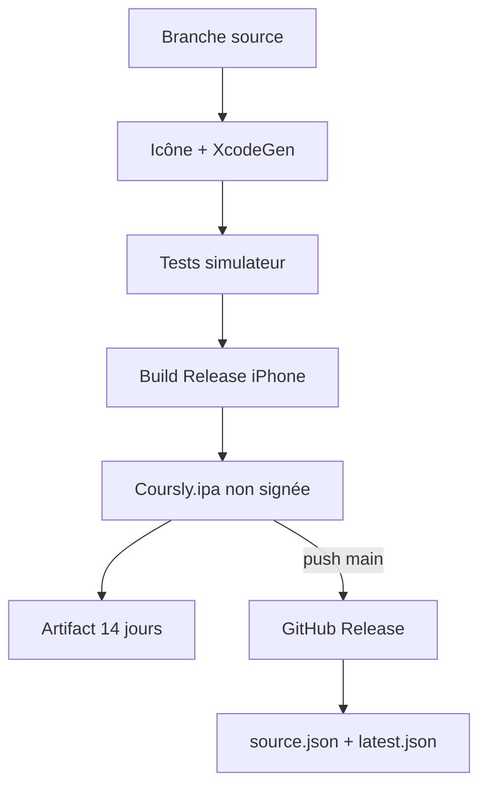

# Build et distribution

Coursly est distribué sous forme d’IPA non signée. GitHub Actions compile et publie l’application ; la signature finale est effectuée directement sur l’iPhone avec Feather, SideStore ou un outil équivalent.

## Rôle des branches

| Branche | Rôle | Écriture automatique |
| --- | --- | --- |
| `main` | développement, tests et source des builds | déclenche la publication |
| `site` | portail GitHub Pages et métadonnées | mise à jour par GitHub Actions |

Les changements importants sont développés sur une branche, proposés par pull request puis fusionnés dans `main`. La branche `site` ne reçoit pas le code Swift.

## Déclencheurs

Le workflow [`.github/workflows/build.yml`](../.github/workflows/build.yml) s’exécute :

- sur les pull requests vers `main` pour tester, compiler et empaqueter ;
- sur les pushes vers `main` pour effectuer les mêmes contrôles puis publier ;
- manuellement avec `workflow_dispatch`.

Les changements limités à Markdown, `docs/**`, `README.md` ou `AGENTS.md` sont ignorés par le workflow. Une PR exclusivement documentaire ne crée donc pas de build.

## Pipeline

Étapes exécutées :

1. checkout complet pour lire les tags ;
2. génération de l’icône depuis la source Base64 ;
3. résolution de la version ;
4. installation de XcodeGen et génération du projet ;
5. tests sur le premier simulateur iPhone disponible ;
6. build `Release-iphoneos` sans signature ;
7. création de `Payload/Coursly.app`, puis de `Coursly.ipa` ;
8. lecture de la taille et calcul SHA-256 ;
9. sur `main`, création d’une prerelease GitHub ;
10. sur `main`, mise à jour de la branche `site` ;
11. upload de l’IPA comme artifact conservé 14 jours.

## Versionnement

`MARKETING_VERSION` dans [`project.yml`](../project.yml) fournit la série majeure/mineure, actuellement `0.3`. Le workflow cherche le dernier tag `v0.3.N`, incrémente `N`, puis utilise :

- `CFBundleShortVersionString = 0.3.N` ;
- `CFBundleVersion = N` ;
- tag Git `v0.3.N` ;
- titre de Release `Coursly 0.3.N`.

Une republication manuelle après création du tag doit être examinée avant lancement : le workflow calculera normalement le numéro suivant.

## Contenu publié

La Release contient `Coursly.ipa` et est marquée comme prerelease. La branche `site` reçoit :

- `source.json`, catalogue compatible AltStore avec au plus vingt versions de la série ;
- `latest.json`, pointeur compact vers la dernière version.

Les deux fichiers contiennent notamment version, build, date UTC, URL de téléchargement, taille et SHA-256. Le bundle identifier public est `fr.bastiannoel.coursly` et la version minimale déclarée est iOS 26.

## Installation

1. télécharger `Coursly.ipa` depuis le portail ou la Release ;
2. vérifier le SHA-256 si l’outil de signature le permet ;
3. importer l’IPA dans Feather, SideStore ou un outil compatible ;
4. signer avec son propre certificat et profil de provisioning ;
5. installer et lancer sur l’iPhone.

L’IPA publiée ne contient ni certificat de distribution ni profil utilisateur.

## Vérification après fusion

Pour une modification de code, vérifier dans l’ordre :

- tests Swift verts ;
- build Release iPhone vert ;
- étape `Package IPA` verte ;
- Release portant la version attendue ;
- asset `Coursly.ipa` téléchargeable ;
- `source.json` et `latest.json` mis à jour sur `site` ;
- artifact CI présent ;
- SHA-256 identique entre Release et métadonnées.

La référence intégrale connue est le run `#88` (`32844625963`), qui a publié `0.3.12`.

## Échecs et reprise

| Échec | Effet | Reprise |
| --- | --- | --- |
| Tests ou build | aucune publication | corriger sur branche et relancer |
| Packaging | aucune Release | inspecter le chemin du `.app` |
| Création de Release | site non mis à jour | corriger les permissions ou le tag avant relance |
| Push vers `site` | Release existante, portail ancien | corriger puis mettre les métadonnées en cohérence |
| Artifact seulement | n’affecte pas l’IPA déjà publiée | relancer si l’archive CI est nécessaire |

Ne jamais supprimer ou remplacer silencieusement une Release utilisée. En cas de contenu incorrect, documenter l’incident et publier un nouveau numéro cohérent.

## Sécurité

Ne jamais committer :

- certificat `.p12` ;
- mot de passe de certificat ;
- clé privée ;
- profil `.mobileprovision` personnel ;
- token GitHub ou identifiant de signature.

Le `GITHUB_TOKEN` fourni au job suffit à créer la Release et à mettre à jour `site` dans le cadre des permissions du workflow.
